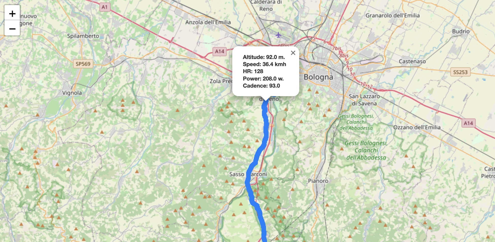
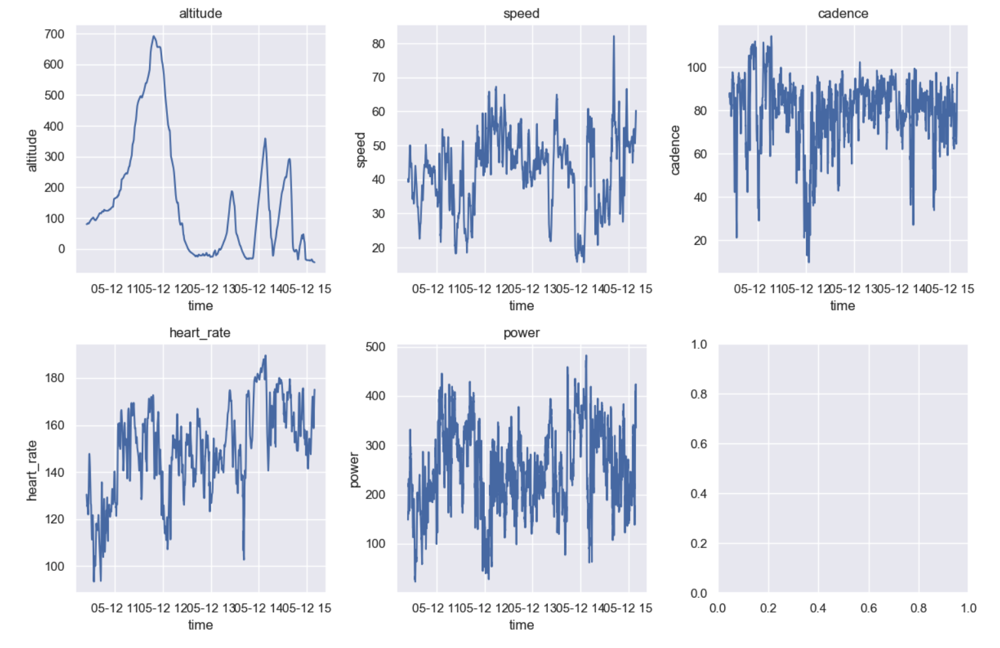

# Garmin Cycling and Running
In this repository, you will discover a collection of tools designed for reading and analyzing **Garmin** files in the **FIT** or **TCX** format.

## How to use
In the [EDA](./eda_fit.ipynb) you'll find examples on how-to load a FIT file, analyze it and display points on a map.
## Examples

    
## Conda Environment
To create Python environment, with all required libraries:

```
conda create -n garmin python=3.9
```
```
conda activate garmin
```
clone the git repo
```
git clone https://github.com/luigisaetta/garmin_cycling.git
```
cd garmin_cycling
```
pip install -f requirements.txt
```
